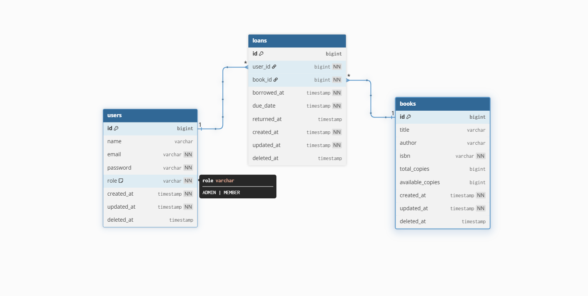
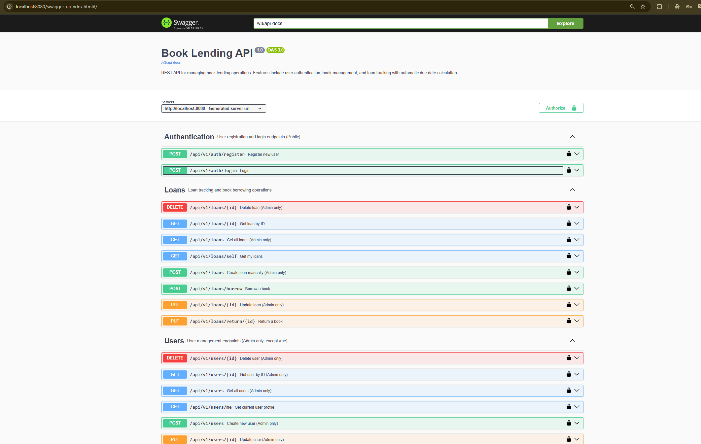

# DemandLane Book Lending API
A REST API for managing book lending operations — user authentication, book catalog management, and loan tracking.

# ERD


# API Documentation


## Requirements

- [Docker](https://docs.docker.com/get-docker/) & Docker Compose

## Getting Started

### 1. Configure environment

```bash
cp .env.example .env
```

Edit `.env` and set your own values, especially:
- `POSTGRES_PASSWORD` / `SPRING_DATASOURCE_PASSWORD` — database password
- `JWT_SECRET` — must be at least 32 characters

### 2. Start the application

```bash
docker compose up -d
```

> **No Docker?** Make sure a PostgreSQL instance is running locally, update `.env` accordingly, then run:
> ```bash
> mvn clean spring-boot:run
> ```

Docker Compose automatically loads `.env` from the current directory.

### 3. Stop the application

```bash
docker compose down
```

To also remove the database volume:

```bash
docker compose down -v
```

---

## Accessing the API

| Resource       | URL                                      |
|----------------|------------------------------------------|
| Swagger UI     | http://localhost:8080/swagger-ui.html    |
| OpenAPI JSON   | http://localhost:8080/v3/api-docs        |
| Health check   | http://localhost:8080/actuator/health    |

## Default Seed Accounts

| Role  | Email                    | Password      |
|-------|--------------------------|---------------|
| Admin | admin@demandlane.com     | password123   |
| User  | a@demandlane.com         | password123   |

seeded accounts ranged from a - e @demandlane.com

> Accounts are seeded automatically on first startup.
> 10 Books are seeded as well

## Authentication

1. `POST /api/v1/auth/login` with email + password → returns a JWT token
2. Click **Authorize** in Swagger UI and enter: `Bearer <token>`

---

## Running Tests

```bash
mvn clean test
```

## Environment Variables

See [.env.example](.env.example) for the full list of configurable variables.
